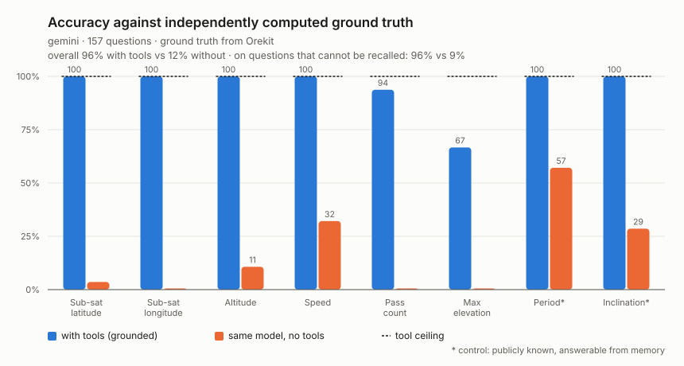

# Helios

Orbital mechanics answers computed by real tools — with explicit assumptions, uncertainty,
and sources — instead of guessed by a language model.

Helios is the project. **Cosma** is the platform it is building toward; **Atlas** is the
scientific agent that reasons over it.

> **Status: live.** Fifteen tools spanning Earth orbit, the solar system and literature — the
> numerical ones checked against an independent implementation before counting as done; ten of
> them exposed to a tool-calling agent; an evaluation harness with 202 questions whose ground
> truth came from Orekit; and 404 tests on every push. Nothing here claims a capability that
> isn't shipped — where a measurement is incomplete, it says so.
>
> **[satpass.vercel.app](https://satpass.vercel.app)**

---

## The problem

Ask a frontier model when your satellite passes over a ground station and it will give you a
confident, well-formatted, plausible answer. It is frequently wrong — not garbled, just wrong
by a few hundred kilometres, because the model recalled a number instead of computing one.

Existing tools solve this and introduce a different problem. GMAT and STK compute correctly and
are hostile to use; answering one question means learning a scripting environment. Small
satellite teams and university labs end up in spreadsheets.

## The approach

A language model decides *what to compute*. Validated scientific libraries do the computing.
Every number returned carries where it came from.

- **Typed tools, not improvised code.** Reference frames (TEME/GCRS/ITRF), time scales
  (UTC/TT/TAI), and units are fixed in tested code rather than re-derived per question. This is
  where orbital software fails, and it fails silently.
- **Provenance per value, not per answer.** A single sentence can mix a measured TLE epoch, a
  derived orbital period, and a predicted pass time. Each is labelled separately as observed,
  derived, predicted, or speculative — and a derived value inherits the weakest tier of its
  inputs.
- **Measured, not asserted.** Correctness is checked against an independent implementation
  (Orekit/GMAT), closed-form analytics, and real-world observation — never against the same
  library that produced the answer.

## Accuracy

Measured against **202 questions whose answers were computed by Orekit** — an independent
implementation, never by the code being graded. Seven satellites spanning low Earth orbit,
sun-synchronous, geostationary, medium Earth orbit and a highly eccentric orbit, plus the Sun,
Moon and seven planets across five epochs from 2026 to 2030.

**188 of the 202 cannot be answered from memory.** That constraint is what makes the comparison
mean anything: *"what is the ISS's altitude"* sits in every model's training data, so a set of
publicly-known facts would let a bare model score well without computing anything. Sub-satellite
longitude at `2026-08-13T14:45Z` has to be calculated. The other 14 are a deliberate control —
values a model should get right from recall alone.

**What this number covers:** the Earth-orbit tools and the planetary ephemeris. Decay and
literature are deliberately outside it, for reasons that are not oversight — decay answers with
a *range* rather than a point value, so scoring it against a single number would measure the
wrong thing, and citation verification is not numeric at all. Both are verified by their own
differential tests, described under [Current scope](#current-scope). Extending a numeric accuracy
figure over them would be extending a measurement past what it can mean.

<picture>
  <source media="(prefers-color-scheme: dark)" srcset="docs/img/accuracy-dark.svg">
  
</picture>

| | Overall | On questions that cannot be recalled |
|---|---|---|
| **Tool ceiling** — perfect tool selection | **100%** | **100%** |
| **Grounded agent** — model plus tools | **99.0%** | **98.9%** |
| **Bare model** — same model, no tools | 9.9% | 7.4% |

All 202 questions, zero transport failures in the scored set. A provider rate limit is not a
wrong answer, and neither is a dropped connection, so runs that hit one are retried rather than
scored — counting them would understate the system by whatever the day's quota and the laptop's
memory pressure happened to be.

The tool ceiling is what the tools achieve when every question reaches the right one. It is the
upper bound on anything the agent can reach, so the gap between it and the grounded run is the
cost of tool selection, isolated from numerical error. Reaching 100% also means skyfield and
Orekit — two independent implementations — agree on every question, in every regime.

| Category | Grounded | Bare model | n |
|---|---|---|---|
| Distance from Earth | **98%** | 2% | 45 |
| Sub-satellite longitude | **100%** | 0% | 28 |
| Sub-satellite latitude | **100%** | 4% | 28 |
| Altitude | **100%** | 11% | 28 |
| Speed | **100%** | 32% | 28 |
| Pass count | **94%** | 0% | 16 |
| Max elevation | **100%** | 0% | 15 |
| Inclination* | **100%** | 29% | 7 |
| Orbital period* | **100%** | 57% | 7 |

*\* control — publicly known, answerable from memory.*

The bare model scoring 12% rather than 0% is expected, not a flaw: it can guess ISS altitude
within 10 km and orbital speed within 0.05 km/s, because those barely vary. It collapses on
anything genuinely time-dependent — 0% on sub-satellite longitude, which changes every second
and appears in no training set.

The control questions are the tell. The bare model does best exactly where recall suffices
(57% on orbital period) and worst where it does not. That pattern is what confirms the dataset
measures grounding rather than model quality.

### The two remaining misses

**Pass count, 94% — one off-by-one**, 17 against 18. A boundary effect: this implementation
discards a pass already in progress when the window opens, while the reference counts every
rise. Both are defensible; they are not the same convention.

**Distance from Earth, 98% — one declined answer**, not a wrong one. On that question the agent
returned nothing the harness could read a number out of. Asked the same question afterwards it
answered 2.356119 AU against a reference of 2.356107, comfortably inside tolerance — so the
failure was transient rather than systematic.

It is still scored as a miss. A retry loop that runs until the number appears would be measuring
persistence rather than accuracy, and an answer the caller cannot use is a failure whatever
caused it. Transport failures are retried because they are not the system's output; this was.

### How the planetary tolerance was set

The tolerance is **relative — 1e-4 of the distance** — with a floor of 1e-5 AU, rather than one
fixed figure. A set spanning the Moon at 0.0024 AU and Neptune at 30 cannot use a single absolute
tolerance: tight enough to mean anything at Neptune is physically impossible at the Moon, and
loose enough for Neptune makes the Moon question free.

It was **measured before it was set**, as this project's testing rules require. Across all 45
combinations the analytic ephemeris departs from Orekit's JPL DE by at most 7.05e-4 AU (Uranus)
and 3.6e-5 relative, so the tolerance leaves between 2.8× and several hundred times headroom
depending on the body. Nothing in this category is a control: at 1e-4 relative, even the Sun —
whose distance "is about 1 AU" to everyone — cannot be answered by recalling the round number,
because it varies by 0.017 AU over a year and the tolerance is 1.0e-4.

### What the ceiling was for

Separating the tool ceiling from the agent score is what made every earlier failure diagnosable
instead of a vague "the model is bad at passes". Three times it pointed at something other than
the model:

- **Pass count once scored 12%.** That looked like a reasoning failure. It was a missing
  parameter — `/api/passes` always searched from *now* and had no way to express a start time,
  so the agent was being scored for a hole in the tool surface.
- **Max elevation scored 60–67%** across two runs, returning values like 0.161° for a pass whose
  reference peak was 14°. The tool was right and so was the agent: the question said *"the first
  pass over London"* without stating an elevation mask, so a 0° mask returned a grazing pass —
  a correct answer to an under-specified question. It also gave no coordinates, and the model
  put London at +0.128° instead of −0.128°, in the wrong hemisphere. Stating the mask and the
  coordinates took it to **100%**, and the ground-truth value never changed — the question was
  wrong, not the target.
- **An apparent 72.6%** was 43 rate-limit failures being scored as wrong answers.

None of those were model failures, and all three would have been invisible without an
independently computed upper bound to compare against.

### Reproducing it

The science service runs from `backend/`, which is its own Python project.

```bash
# Ground truth, from the independent implementation
cd backend && uv run python ../tools/eval/generate_questions.py

# Pin the science service to the same element sets the ground truth used, and start the web app
EVAL_FIXTURES=../eval/tle_fixtures.json uv run uvicorn api.main:app --port 8787
npm run dev:web

# The ceiling solver calls the tools directly and needs no model
cd backend
uv run python ../tools/eval/run_eval.py --solver ceiling
uv run python ../tools/eval/run_eval.py --solver baseline --provider gemini --delay 10
uv run python ../tools/eval/run_eval.py --solver grounded --provider gemini --delay 10
uv run python ../tools/eval/make_chart.py
```

The agent runs checkpoint after every question and resume from where they stopped, so an
interrupted pass costs only the questions it had left. Results that failed in transport are
dropped on resume and retried rather than carried forward, so a dropped connection cannot be
baked into an accuracy figure.

Pinning is not optional. Without `EVAL_FIXTURES` the catalog serves live element sets while the
ground truth was computed from frozen ones, so the system is graded against a target it was
never given — and the error grows silently as the elements age.

## Stack

| Layer | Choice |
|---|---|
| Web | Next.js 16, React 19, TypeScript, Tailwind 4 |
| Science | Python 3.13 — astropy, skyfield, sgp4 |
| Rendering | Cesium for Earth orbit, three.js for the solar system |
| Orbital data | Celestrak · JPL Horizons and SBDB · Yale Bright Star Catalogue |
| Hosting | Vercel — one project, two services, one domain |

Python owns the science because the validated ecosystem lives there and there is no JavaScript
binding to SPICE. The rule throughout is to integrate existing, flight-proven implementations
rather than write competing ones.

Two renderers, deliberately. Cesium has correct WGS84 geodesy, terrain occlusion and
time-dynamic entities, which is what Earth orbit needs; three.js handles the solar system.
Forcing one renderer across 26 orders of magnitude is a floating-point precision trap — two
regimes, two renderers.

The deployment is two Vercel services sharing a domain: `web` (Next.js, the UI and the agent
loop) and `science` (FastAPI, everything under `/api`). The web service reaches science over a
service binding rather than a public URL, so the hop is deployment-aware and never leaves the
project.

## Running locally

Requires Node 24+ and [uv](https://docs.astral.sh/uv/).

```bash
npm install                        # web dependencies
cd backend && uv sync --extra dev  # science dependencies (uv provides Python 3.13)
```

Two processes, in separate terminals — the science service and the web app are separate
runtimes, and the web app proxies `/api` to the service in development:

```bash
npm run dev:api      # FastAPI science service on 127.0.0.1:8787
npm run dev:web      # Next.js on http://localhost:3002
```

The tools work with no configuration. To use the agent, add a provider key to `.env.local`
(see `.env.example`) or run a local Ollama.

Checks — every one of these runs in CI on every push, alongside a production build:

```bash
npm run typecheck
npm run lint
npm run test:web   # 27 tests, Node's own runner — no framework, no build step
npm run test:py    # 377 tests
npm run lint:py
```

Before and after a deployment, the launch smoke exercises the homepage and every critical
reviewer-facing science path without consuming model quota:

```bash
npm run smoke -- --base-url=https://satpass.vercel.app
```

## Current scope

Fifteen endpoints on the science service, ten of them exposed to the agent as typed tools. Each
was verified against an independent source before counting as done.

**Earth orbit**

| Tool | Agreement with the independent implementation |
|---|---|
| Satellite lookup | Live Celestrak, cached, with an offline twin for tests |
| SGP4 propagation | 0.06 mm position, 0.0005 mm/s velocity, out to a full day |
| Frame conversion | GCRF→ITRF 2.5 cm; TEME→ITRF 1.12 m, against a 44 km frame-confusion error |
| Orbital elements | a to 1 m, e to 1e-9, angles to 1e-6° |
| State at an instant | Sub-satellite point, altitude, speed |
| Ground track | Sub-satellite path over a window |
| Ground-station access | 16/16 pass counts, 15/15 peak elevations |
| Eclipse and beta angle | Conical shadow, umbra and penumbra separated, boundaries to 2 s |
| Orbital decay lifetime | Answers with a **range**, not a number — see below |

**The solar system**

| Tool | Agreement with the independent implementation |
|---|---|
| Planetary ephemeris | 3.6e-5 of distance against Orekit's JPL DE, worst of 45 samples |
| Moons | 20 major moons from JPL Horizons elements, within 3% of orbit radius |
| Asteroids | 763 catalogued bodies from JPL SBDB |
| Bright stars | 8,355 stars from the Yale Bright Star Catalogue via VizieR |

**Literature**

| Tool | What it guarantees |
|---|---|
| Search | Returns only what the tool actually fetched |
| Citation verification | Resolves claimed identifiers and names the ones that do not exist |

Underneath all of it, time scales agree with Orekit to under a nanosecond across the 2012 and
2017 leap seconds — because a 69-second confusion between UTC and TT moves a low-orbit satellite
about 500 km along-track, and nothing raises when it happens.

**404 tests** — 377 Python, 27 TypeScript — run on every push.

### Three things worth singling out

**Decay lifetime answers with a range.** Orbital lifetime depends on solar activity, and solar
activity is not forecastable years ahead, so a single confident number would be close to
dishonest. The simplified model is graded against full numerical propagation: it runs 1.14× to
1.39× long across the reference cases, always in the same direction, and that bias is smaller
than the 3–5× solar spread it reports. A test asserts that ordering — if it ever inverted, the
range would be measuring model error rather than physics.

**The agent may only cite what the tool fetched.** A fabricated reference is indistinguishable
from a real one by reading it, so `/api/literature/verify` resolves claimed identifiers against
the source and names the ones that do not exist. The constraint held end to end, including while
the tool was failing — which is when it counts.

**The solar system states its own distortion.** Bodies are always true to scale; below nine
pixels of real angular size they draw as labelled markers, so nothing is exaggerated and nothing
is invisible. There is a true-scale toggle that makes the planets vanish, which is the honest
picture. Orbits are traced from the ephemeris, so each planet sits on its own path by
construction rather than by adjustment.

### Not built yet

The sandboxed code path for questions no fixed tool covers. It is deliberately last: shipping
code generation before the evaluation harness existed would have produced a system whose errors
could not be detected. The harness exists now, so the escape hatch can be graded by it.

### On the public deployment

The agent endpoint is public and unauthenticated — a stranger has to be able to ask a question
for this to make its argument at all. It is protected by a per-client rate limit and a shared
daily budget on model calls, charged by what a question actually cost rather than by request
count. Both limiters hold their counters in process memory, so under concurrency the effective
ceiling is per-instance rather than global. That is a real reduction in blast radius, not a hard
cap, and it is written down as the former.

## Not for operational use

Helios is a research and educational tool. **Do not use its output for mission operations,
collision avoidance, launch decisions, or any purpose where an error carries physical, legal,
or financial consequence.** Answers depend on third-party orbital data of varying freshness and
accuracy, on models with stated and unstated assumptions, and on a language model's choice of
what to compute. Verify independently before acting on anything here.

## Licence

[Apache License 2.0](LICENSE). Copyright © 2026 Faiz Shaikh.

Provided "as is", without warranty of any kind, express or implied — see sections 7 and 8 of
the licence.
